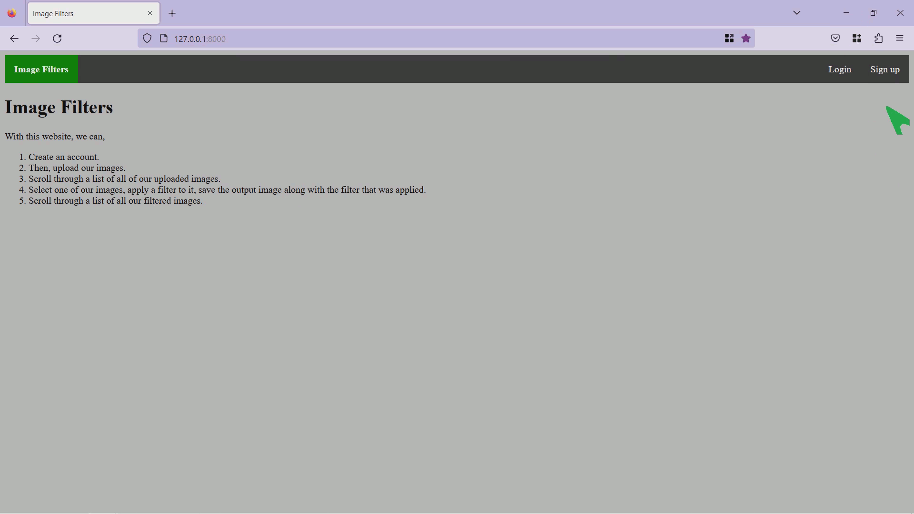
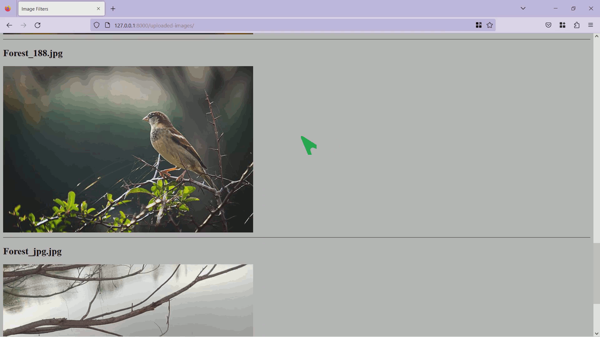
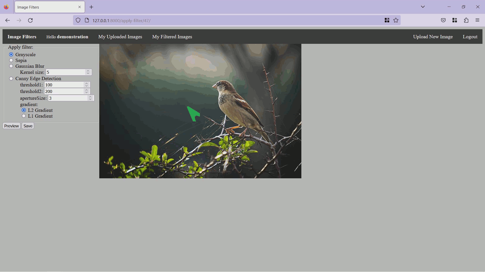
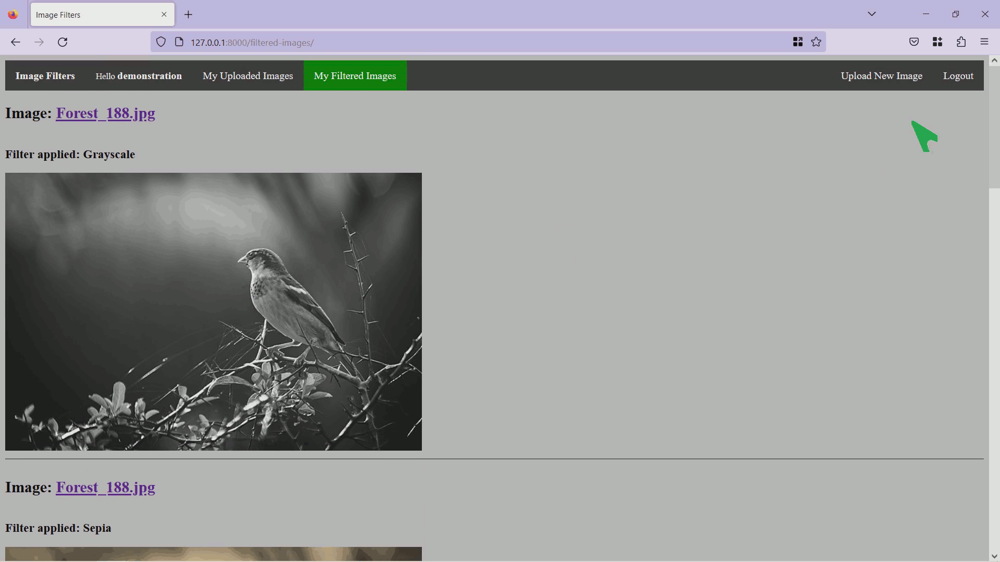

## Demonstration of the project:

Please note that all the gifs loop forever.  

----

### 1. Signing up and logging in:

----

### 2. Uploading images:

----

### 3. Scrolling through uploaded images:

----

### 4. Going to the apply-filter page:

1. Clicking on any uploaded image, takes to the apply-filter page which has Grayscale, Sepia, Gaussian Blur and Canny Edge Detection. The blur and edge-detection filters have their own settings.
2. Notice that there are `Preview` and `Save` buttons. Preview just applies the filter to the image and shows it. Save saves the filtered image along with the what filter was applied.
3. Please note that the wavy patterns in the gif are the artifacts of the gif itself. The image used on the website is of good quality. I have included all the images used in the website (during demonstration) in the `extras` directory beside this `demonstration.md`.

----

### 5. Applying different filters:

1. In this example, all filtered images are Saved. So, they will appear in the next step while we scroll through all our filtered images.
2. Also, please note that, every time `Preview` or `Save` is clicked, the filter is applied to the *original* image.
3. Please note again that the wavy patterns in the gif are the artifacts of the gif itself. The image used on the website is of good quality. I have included all the images used in the website (during demonstration) in the `extras` directory beside this `demonstration.md`.

----

### 6. Scrolling through our filtered images:

----

### 7. Logging out:

----

Thank you!
